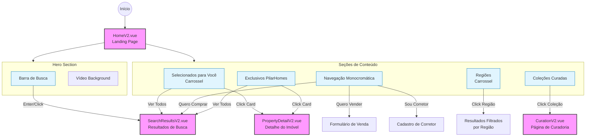
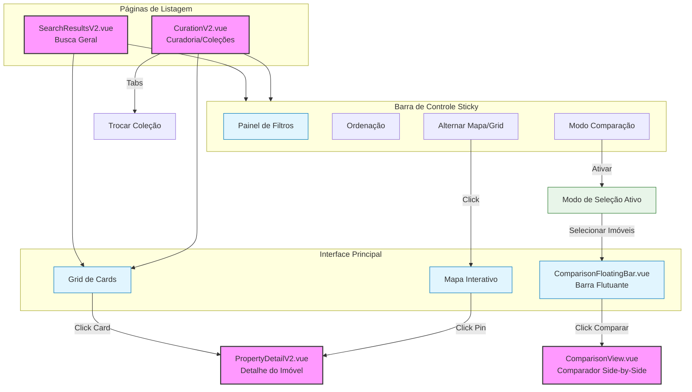

# Fluxogramas de Navegação - Protótipo PilarHomes

Este documento detalha os fluxos de navegação e interação das principais páginas do protótipo: Home, Resultados (Busca), Curadoria e Detalhe do Imóvel (Single Page).

## 1. Home (Página Inicial)
**Arquivo:** `components/prototypes/HomeV2.vue`

A Home serve como o ponto central de entrada, direcionando o usuário para fluxos de compra, venda ou exploração de coleções.



## 2. Resultados de Busca & Curadoria
**Arquivos:** `SearchResultsV2.vue` e `CurationV2.vue`

Estas páginas compartilham estruturas similares de listagem, mas com propósitos diferentes (exploração vs. coleções temáticas).



## 3. Detalhe do Imóvel (Single Page)
**Arquivo:** `PropertyDetailV2.vue`

Página de imersão total no imóvel, com foco em conversão e análise.

```mermaid
flowchart TD
    %% Página Principal
    Detail[PropertyDetailV2.vue<br/>Detalhe do Imóvel]
    
    %% Seções
    subgraph Content [Conteúdo Rico]
        Gallery[Galeria Fullscreen]
        Info[Informações Principais]
        Specs[Características & Comodidades]
        MapSection[Localização]
    end
    
    %% Ações Flutuantes / Header
    subgraph Actions [Ações de Conversão]
        Contact[Contatar Concierge]
        Schedule[Agendar Visita]
        Share[Compartilhar]
        Save[Salvar/Favoritar]
    end
    
    %% Fluxos Avançados
    subgraph Advanced [Fluxos Avançados]
        AIAnalysis[Análise de Valor (IA)]
        AddToCompare[Adicionar à Comparação]
    end

    %% Conexões
    Detail --> Content
    Detail --> Actions
    
    %% Interações
    Gallery -->|Navegar| ViewImages[Visualizar Fotos]
    
    Contact -->|Click| WhatsApp[WhatsApp / Chat]
    Schedule -->|Click| CalendarModal[Modal de Agendamento]
    
    AddToCompare -->|Click| FloatBar[ComparisonFloatingBar.vue]
    FloatBar -->|Comparar| ComparePage[ComparisonView.vue]
    
    AIAnalysis -->|Click| AIModal[Modal de Insights de Preço]

    %% Estilização
    classDef page fill:#f9f,stroke:#333,stroke-width:2px;
    classDef section fill:#fff3e0,stroke:#ef6c00,stroke-width:1px;
    classDef external fill:#eceff1,stroke:#455a64,stroke-width:1px;

    class Detail,ComparePage page;
    class Gallery,Info,Specs,MapSection section;
    class WhatsApp,CalendarModal,AIModal external;
```

## 4. Fluxo Global de Comparação
**Arquivo:** `ComparisonView.vue`

O fluxo de comparação conecta diferentes pontos da jornada do usuário.

```mermaid
flowchart LR
    %% Origens
    Results[Resultados] -->|Selecionar| Bar[Barra Flutuante]
    Curation[Curadoria] -->|Selecionar| Bar
    Detail[Detalhe] -->|Adicionar| Bar
    
    %% Barra
    Bar -->|Validar (>1)| CompareBtn[Botão Comparar]
    
    %% Página de Comparação
    CompareBtn --> View[ComparisonView.vue]
    
    subgraph CompareUI [Interface de Comparação]
        Header[Header Sticky]
        Accordion[Seções Expansíveis]
        DiffHighlight[Highlight de Diferenças]
    end
    
    View --> CompareUI
    
    %% Saídas
    CompareUI -->|Salvar| UserProfile[Perfil do Usuário]
    CompareUI -->|Concierge| Contact[Contato]
    CompareUI -->|Voltar| Previous[Página Anterior]

    %% Estilização
    classDef flow fill:#e3f2fd,stroke:#1565c0,stroke-width:2px;
    classDef ui fill:#f3e5f5,stroke:#7b1fa2,stroke-width:1px;

    class Results,Curation,Detail,View flow;
    class Bar,CompareUI ui;
```
